# Dashboard Table Redesign - Active Lots Enhancement


## Overview

This design document outlines the comprehensive redesign of the Active Lots table in the dashboard to provide a robust, responsive, and user-friendly data visualization experience. The enhancement focuses on preventing table overflow, implementing density modes with persistence, and maintaining the existing design language while improving functionality.

### Design Goals

- **Prevent Overflow**: Ensure table content never exceeds container boundaries
- **Density Control**: Provide Comfortable and Compact viewing modes with persistence
- **Visual Consistency**: Maintain existing design tokens, colors, and iconography
- **Mobile Optimization**: Ensure seamless experience across all device sizes
- **Performance**: Implement CSS-driven solutions for predictable behavior

### Scope

This redesign specifically targets:
- `src/pages/dashboard.html` (Active Lots section only)
- `src/styles/tokens.css` (adding minimal helper classes)
- Addition of a small scoped script for density toggle functionality
- No modifications to shared layout or other pages

## Architecture

### Component Structure

The dashboard table system consists of four primary architectural layers:

### Column Width Specifications

The table implements a fixed-layout design with explicit column widths to ensure predictable text truncation:

```html
<colgroup>
  <col class="w-28" /> <!-- LOT ID -->
  <col class="w-[30%]" /> <!-- STYLE/TEMPLATE -->
  <col class="w-24" /> <!-- SIZE -->
  <col class="w-36" /> <!-- CURRENT STEP -->
  <col class="w-64 lg:w-56" /> <!-- PROGRESS -->
  <col class="w-44" /> <!-- LAST UPDATE -->
  <col class="w-48" /> <!-- ASSIGNED -->
</colgroup>
```

This column structure ensures:
- Cells cannot expand beyond defined widths
- Text truncation occurs predictably
- Layout remains consistent across different data sets
- No horizontal overflow occurs within the card container

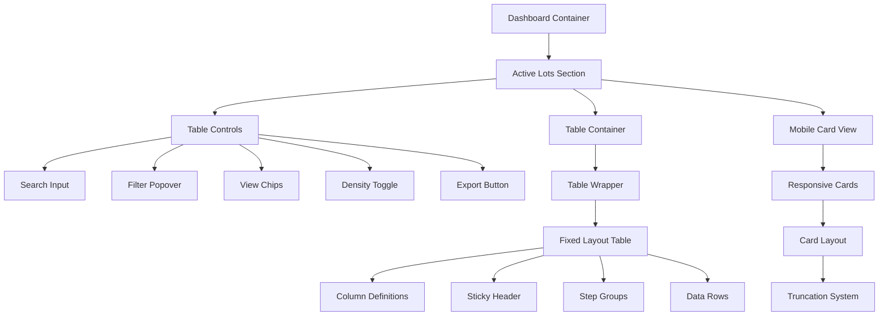

### Data Flow

The table system follows a structured data presentation pattern:

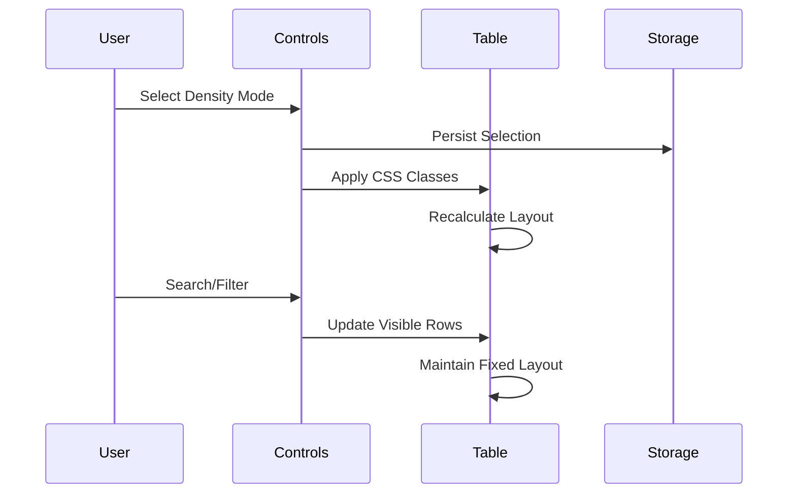

## Table Container System

### Fixed Layout Strategy

The table implements a fixed-width layout system to ensure predictable text truncation and prevent overflow scenarios.

### Table Wrapper Implementation

The table will be wrapped in a scroll-safe container with the following structure:

```html
<div class="relative overflow-x-auto overflow-y-visible max-w-full" id="lots-table">
  <table class="table-fixed w-full align-middle">
    <!-- colgroup definitions -->
    <!-- table header -->
    <!-- table body -->
  </table>
</div>
```

This wrapper ensures:
- Horizontal scrolling is contained within the card
- Vertical overflow remains visible for dropdowns/popovers
- Maximum width is constrained to prevent page overflow
- The ID enables density mode targeting

| Column | Width Allocation | Responsive Behavior | Content Strategy |
|--------|------------------|-------------------|------------------|
| Lot ID | `w-28` (112px) | Fixed | Ellipsis truncation with tooltip |
| Style/Template | `w-[30%]` | Flexible | Multi-line clamp on desktop, single-line on mobile |
| Size | `w-24` (96px) | Fixed | Badge display with abbreviated values |
| Current Step | `w-36` (144px) | Fixed | Status chips with no-wrap constraint |
| Progress | `w-64 lg:w-56` | Responsive | Bar + fraction with responsive width |
| Last Update | `w-44` (176px) | Fixed | Date format with no-wrap |
| Assigned | `w-48` (192px) | Fixed | Avatar + name with ellipsis |

### Container Architecture

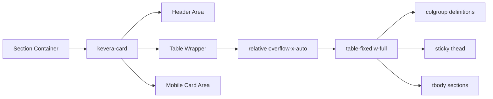

## Text Truncation Framework

### Utility Classes

The design introduces a comprehensive text handling system through CSS utility classes:

These helper classes will be added to `src/styles/tokens.css`:

```css
.minw0 { min-width: 0 }
.ellipsis { overflow: hidden; text-overflow: ellipsis; white-space: nowrap }
.wrap-anywhere { overflow-wrap: anywhere; word-break: break-word }
.clamp-2 { display: -webkit-box; -webkit-line-clamp: 2; -webkit-box-orient: vertical; overflow: hidden }
.sr-only { position:absolute; width:1px; height:1px; padding:0; margin:-1px; overflow:hidden; clip:rect(0,0,0,0); white-space:nowrap; border:0 }
```

These classes are safe and do not alter existing tokens or utilities.

| Class | Purpose | Implementation |
|-------|---------|----------------|
| `.minw0` | Enables flex shrinking | `min-width: 0` |
| `.ellipsis` | Single-line truncation | `overflow: hidden; text-overflow: ellipsis; white-space: nowrap` |
| `.wrap-anywhere` | Emergency line breaking | `overflow-wrap: anywhere; word-break: break-word` |
| `.clamp-2` | Two-line text clamping | WebKit line clamp with vertical overflow hidden |
| `.sr-only` | Screen reader only content | Accessibility-friendly hidden text |

### Cell-Specific Truncation Strategy

Each table cell implements targeted truncation based on content type:

#### Lot ID Cell Structure
```html
<td class="px-3 py-2 align-middle">
  <div class="flex items-center gap-3">
    <input type="checkbox" class="kevera-checkbox">
    <span class="ellipsis inline-block max-w-[120px] font-semibold text-gray-900 dark:text-white" title="{lotId}">LOT-001</span>
  </div>
</td>
```

#### Style/Template Cell Structure
```html
<td class="px-3 py-2 align-middle">
  <div class="flex items-center gap-2 minw0">
    <div class="w-8 h-8 bg-gradient-to-br from-blue-500 to-blue-600 rounded-lg flex items-center justify-center text-white text-xs font-bold shrink-0">A</div>
    <div class="minw0 max-w-[300px] ellipsis lg:clamp-2" title="{fullName}">Classic Polo – Style A</div>
  </div>
</td>
```

#### Size Cell Structure
```html
<td class="px-3 py-2 text-center whitespace-nowrap">
  <span class="ellipsis inline-block max-w-[80px]" title="Medium">M</span>
</td>
```

#### Current Step Cell Structure
```html
<td class="px-3 py-2 align-middle">
  <span class="kevera-badge kevera-badge--success whitespace-nowrap">Sewing</span>
</td>
```

#### Progress Cell Structure
```html
<td class="px-3 py-2 align-middle">
  <div class="flex items-center gap-2 minw0">
    <div class="progress-w h-2 bg-gray-200 rounded-full overflow-hidden lg:w-48 w-full">
      <div class="h-2 bg-primary rounded-full" style="width: 50%"></div>
    </div>
    <span class="text-sm text-muted whitespace-nowrap">50/100</span>
  </div>
</td>
```

#### Last Update Cell Structure
```html
<td class="px-3 py-2 align-middle">
  <span class="text-sm text-gray-600 dark:text-gray-400 whitespace-nowrap">Jan 15, 2024</span>
</td>
```

#### Assigned Cell Structure
```html
<td class="px-3 py-2 align-middle relative">
  <div class="flex items-center gap-2 minw0">
    <div class="w-7 h-7 bg-gradient-to-br from-green-500 to-green-600 rounded-full flex items-center justify-center text-white text-xs font-bold shrink-0">O1</div>
    <span class="ellipsis inline-block align-middle max-w-[160px] text-sm" title="{fullName}">Operator 1</span>
    <div class="absolute right-0 top-1/2 -translate-y-1/2">
      <button class="kevera-btn kevera-btn--ghost kevera-btn--xs shrink-0" title="More actions">
        <span class="material-symbols-outlined">more_vert</span>
      </button>
    </div>
  </div>
</td>
```

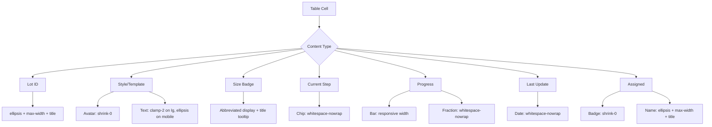

## Density Mode System

### Mode Definitions

The system supports two distinct density modes optimized for different use cases:

### Density CSS Implementation

The following CSS rules will be added to `src/styles/tokens.css`:

```css
.density-comfortable table th, .density-comfortable table td { padding: 0.5rem 0.75rem; line-height: 1.25rem }
.density-compact table th, .density-compact table td { padding: 0.25rem 0.5rem; line-height: 1.125rem; font-size: 0.875rem }
.density-comfortable .progress-w { width: 14rem }
.density-compact .progress-w { width: 10rem }
.density-compact .chip, .density-compact .badge { transform: scale(0.92) }
```

### Density Toggle Implementation

The existing density toggle buttons will be enhanced with the following structure:

```html
<div class="flex items-center bg-gray-100 dark:bg-gray-700 rounded-lg p-1">
  <button class="px-3 py-1 text-xs font-medium rounded bg-white dark:bg-gray-600 text-gray-900 dark:text-white shadow-sm" data-density="comfortable" aria-pressed="true">Comfortable</button>
  <button class="px-3 py-1 text-xs font-medium text-gray-600 dark:text-gray-400 hover:text-gray-900 dark:hover:text-white transition-colors" data-density="compact" aria-pressed="false">Compact</button>
</div>
```

### Density Persistence Script

A small inline script will be added at the end of the Active Lots section to handle density mode persistence:

```javascript
(function() {
  const tableWrapper = document.getElementById('lots-table');
  const densityButtons = document.querySelectorAll('[data-density]');
  
  // Load saved density preference
  const savedDensity = localStorage.getItem('lotsDensity') || 'comfortable';
  tableWrapper.className = tableWrapper.className.replace(/density-\w+/, '') + ' density-' + savedDensity;
  
  // Update button states
  densityButtons.forEach(button => {
    const isCurrent = button.dataset.density === savedDensity;
    button.setAttribute('aria-pressed', isCurrent);
    if (isCurrent) {
      button.classList.add('bg-white', 'dark:bg-gray-600', 'text-gray-900', 'dark:text-white', 'shadow-sm');
      button.classList.remove('text-gray-600', 'dark:text-gray-400', 'hover:text-gray-900', 'dark:hover:text-white');
    } else {
      button.classList.remove('bg-white', 'dark:bg-gray-600', 'text-gray-900', 'dark:text-white', 'shadow-sm');
      button.classList.add('text-gray-600', 'dark:text-gray-400', 'hover:text-gray-900', 'dark:hover:text-white');
    }
  });
  
  // Handle density toggle
  densityButtons.forEach(button => {
    button.addEventListener('click', () => {
      const selectedDensity = button.dataset.density;
      
      // Update wrapper class
      tableWrapper.className = tableWrapper.className.replace(/density-\w+/, '') + ' density-' + selectedDensity;
      
      // Update localStorage
      localStorage.setItem('lotsDensity', selectedDensity);
      
      // Update button states
      densityButtons.forEach(btn => {
        const isCurrent = btn.dataset.density === selectedDensity;
        btn.setAttribute('aria-pressed', isCurrent);
        if (isCurrent) {
          btn.classList.add('bg-white', 'dark:bg-gray-600', 'text-gray-900', 'dark:text-white', 'shadow-sm');
          btn.classList.remove('text-gray-600', 'dark:text-gray-400', 'hover:text-gray-900', 'dark:hover:text-white');
        } else {
          btn.classList.remove('bg-white', 'dark:bg-gray-600', 'text-gray-900', 'dark:text-white', 'shadow-sm');
          btn.classList.add('text-gray-600', 'dark:text-gray-400', 'hover:text-gray-900', 'dark:hover:text-white');
        }
      });
    });
  });
})();
```

| Aspect | Comfortable Mode | Compact Mode |
|--------|------------------|--------------|
| **Use Case** | Detailed review, extended sessions | Quick scanning, space efficiency |
| **Row Height** | Standard padding (0.5rem 0.75rem) | Reduced padding (0.25rem 0.5rem) |
| **Font Size** | Default (1rem) | Smaller (0.875rem) |
| **Line Height** | 1.25rem | 1.125rem |
| **Progress Bar** | 14rem width | 10rem width |
| **Chip Scaling** | Default size | 92% scale |

### Implementation Architecture

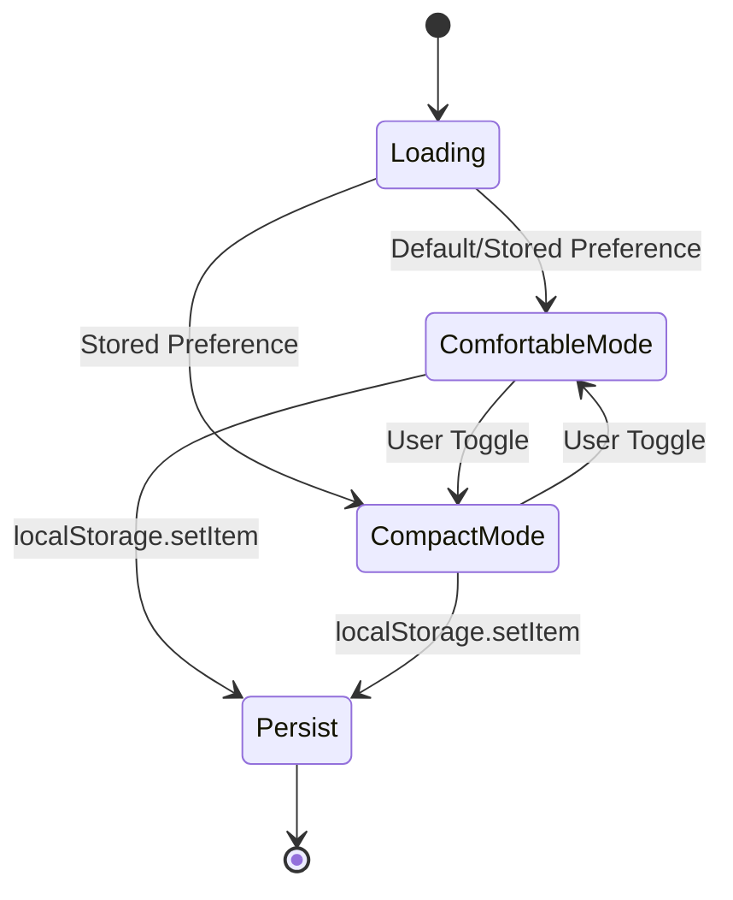

### CSS Implementation Strategy

The density system utilizes CSS custom properties and scoped classes:

```
.density-comfortable {
  /* Table cell spacing */
  table th, table td: padding 0.5rem 0.75rem, line-height 1.25rem
  
  /* Progress bar dimensions */
  .progress-w: width 14rem
}

.density-compact {
  /* Reduced spacing */
  table th, table td: padding 0.25rem 0.5rem, line-height 1.125rem, font-size 0.875rem
  
  /* Compact progress bar */
  .progress-w: width 10rem
  
  /* Scaled elements */
  .chip, .badge: transform scale(0.92)
}
```

## Responsive Design Strategy

### Breakpoint Architecture

The table system adapts across device categories:

| Device Category | Breakpoint | Display Strategy | Key Adaptations |
|----------------|------------|------------------|-----------------|
| Mobile | < 1024px | Card-based layout | Vertical stacking, full-width progress bars |
| Tablet | 1024px - 1279px | Compressed table | Reduced column widths, maintained structure |
| Desktop | ≥ 1280px | Full table layout | Optimal spacing, all features visible |

### Mobile Card System

Mobile devices receive a purpose-built card interface that maintains data hierarchy:

#### Mobile Card Structure

Each mobile card will implement the following structure with enhanced truncation:

```html
<div class="kevera-card p-4">
  <div class="flex items-center justify-between mb-3">
    <div class="flex items-center gap-3 minw0">
      <input type="checkbox" class="kevera-checkbox">
      <span class="font-semibold text-gray-900 dark:text-white ellipsis" title="LOT-001">LOT-001</span>
    </div>
    <span class="kevera-badge kevera-badge--success whitespace-nowrap">Sewing</span>
  </div>
  <div class="flex items-center gap-2 mb-3 minw0">
    <div class="w-8 h-8 bg-gradient-to-br from-blue-500 to-blue-600 rounded-lg flex items-center justify-center text-white text-xs font-bold shrink-0">A</div>
    <div class="minw0">
      <div class="ellipsis font-medium" title="Classic Polo - Style A">Classic Polo - Style A</div>
      <div class="text-sm text-gray-600 dark:text-gray-400">
        <span class="size-badge" data-size="M" aria-label="Size Medium" title="Size Medium">M</span>
      </div>
    </div>
  </div>
  <div class="mb-3">
    <div class="flex items-center gap-2 mb-1">
      <div class="h-2 w-full bg-gray-200 rounded-full overflow-hidden">
        <div class="h-2 bg-primary rounded-full" style="width: 50%"></div>
      </div>
    </div>
    <div class="flex justify-between text-sm text-gray-600 dark:text-gray-400">
      <span class="whitespace-nowrap">50/100</span>
      <span class="whitespace-nowrap">Jan 15, 2024</span>
    </div>
  </div>
  <div class="flex items-center justify-between">
    <div class="flex items-center gap-2 minw0">
      <div class="w-7 h-7 bg-gradient-to-br from-green-500 to-green-600 rounded-full flex items-center justify-center text-white text-xs font-bold shrink-0">O1</div>
      <span class="text-sm ellipsis" title="Operator 1">Operator 1</span>
    </div>
    <button class="kevera-btn kevera-btn--ghost kevera-btn--xs shrink-0" title="More actions">
      <span class="material-symbols-outlined">more_vert</span>
    </button>
  </div>
</div>
```

#### Mobile Optimization Features

Mobile cards implement the following optimizations:
- `minw0` class on text containers to enable flex shrinking
- `ellipsis` class on single-line titles for clean truncation
- `clamp-2` class where two lines of text are desired
- Progress wrapper uses `w-full` for full-width bars
- Fraction text uses `whitespace-nowrap` to avoid reflow
- No horizontal scrolling appears on phones
- Cards do not leak text past their padding

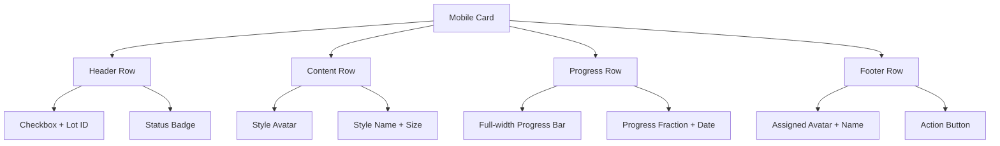

## Interactive Components

### Density Toggle Interface

The density toggle provides immediate visual feedback and persistent state management:

| Component | State | Visual Appearance | Interaction |
|-----------|-------|------------------|-------------|
| **Comfortable Button** | Active | White background, dark text, shadow | Click switches to comfortable |
| **Comfortable Button** | Inactive | Transparent, muted text | Hover effect, click activates |
| **Compact Button** | Active | White background, dark text, shadow | Click switches to compact |
| **Compact Button** | Inactive | Transparent, muted text | Hover effect, click activates |

### State Management Flow

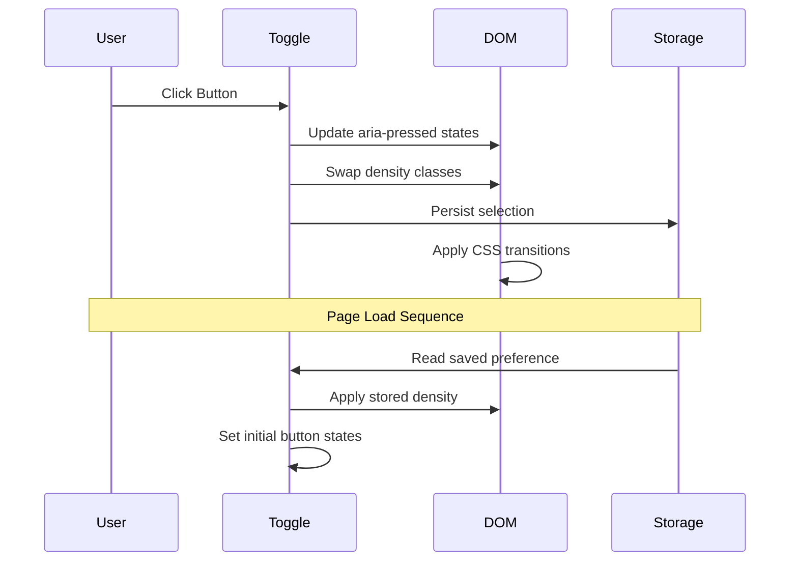

## Sticky Header System

### Header Architecture

The table header implements a multi-layered sticky system for optimal usability:

#### Table Header Implementation
```html
<thead class="kevera-table__header bg-white dark:bg-gray-800 sticky top-0 z-10">
  <tr>
    <th class="px-3 py-2 text-left text-xs font-medium text-gray-500 dark:text-gray-400 uppercase tracking-wider">
      <div class="flex items-center gap-3 minw0">
        <input type="checkbox" class="kevera-checkbox" id="select-all">
        <span class="whitespace-nowrap">Lot ID</span>
        <span class="material-symbols-outlined text-gray-400 cursor-pointer text-sm">unfold_more</span>
      </div>
    </th>
    <!-- Additional column headers with ellipsis class -->
  </tr>
</thead>
```

#### Step Group Header Implementation
```html
<tr class="bg-gray-50 dark:bg-gray-700/50 sticky top-10 z-5">
  <td colspan="7" class="px-3 py-2 border-b border-gray-200 dark:border-gray-600 overflow-hidden">
    <span class="ellipsis block minw0 text-xs font-semibold text-gray-600 dark:text-gray-300 uppercase tracking-wider">SEWING (1)</span>
  </td>
</tr>
```

This implementation ensures:
- Headers remain visible during vertical scrolling
- Proper z-index layering to prevent clipping
- Consistent background colors in both light and dark modes
- Text overflow handling with ellipsis

| Layer | Z-Index | Purpose | Styling |
|-------|---------|---------|---------|
| **Main Header** | z-10 | Column labels and controls | `sticky top-0 bg-white dark:bg-gray-800` |
| **Step Groups** | z-5 | Category separators | `sticky top-10 bg-gray-50 dark:bg-gray-700/50` |

### Scroll Behavior

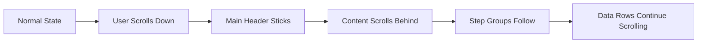

## Performance Considerations

### CSS-Driven Approach

The design prioritizes CSS-based solutions over JavaScript manipulation for consistent performance:

| Technique | Benefit | Implementation |
|-----------|---------|----------------|
| **Fixed Table Layout** | Predictable rendering | `table-layout: fixed` with colgroup |
| **CSS Truncation** | Native browser optimization | Text-overflow and line-clamp properties |
| **Hardware Acceleration** | Smooth transitions | Transform-based animations |
| **Minimal Reflows** | Stable layout | Fixed dimensions and overflow handling |

### Memory Efficiency

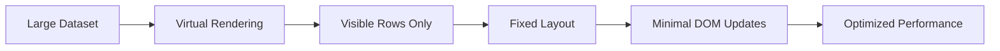

## Accessibility Framework

### Screen Reader Support

The table implements comprehensive accessibility features:

| Feature | Implementation | Purpose |
|---------|----------------|---------|
| **Semantic Structure** | Proper thead/tbody/th elements | Screen reader navigation |
| **ARIA Labels** | aria-pressed on toggle buttons | State communication |
| **Title Attributes** | Truncated text expansion | Content accessibility |
| **Focus Management** | Keyboard navigation support | Non-mouse interaction |

### Keyboard Navigation

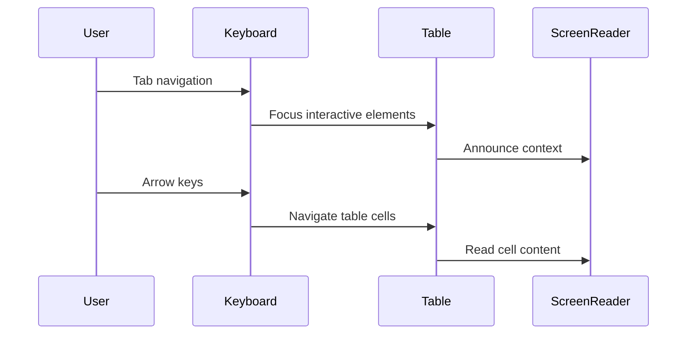

## Testing Strategy

### Responsive Testing Matrix

| Device Category | Screen Widths | Key Validations |
|----------------|---------------|-----------------|
| **Mobile** | 320px - 768px | Card layout, no horizontal scroll, touch interactions |
| **Tablet** | 768px - 1024px | Table responsiveness, density toggle functionality |
| **Desktop** | 1024px+ | Full table features, hover states, overflow prevention |

### Non-Regression Checks

The implementation must pass the following validation checks:

#### Desktop Validation (1280px width)
- No horizontal scroll inside the card
- No text overlaps icons or chips
- Long Style/Template strings truncate or clamp as configured
- Fractions and dates never wrap

#### Density Mode Validation
- Compact mode reduces row height and bar width
- Chips are slightly scaled without misalignment
- Toggle persists on reload and back/forward navigation

#### Mobile Validation
- Cards show clean truncation/clamps
- Full-width bars with no overflow
- Headers remain readable and do not bleed

### Functional Testing Scenarios

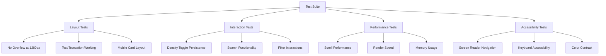

### Cross-Browser Compatibility

| Browser | Version | Key Features to Validate |
|---------|---------|-------------------------|
| **Chrome** | Latest 2 versions | CSS Grid, Flexbox, Line-clamp |
| **Firefox** | Latest 2 versions | Sticky positioning, Text truncation |
| **Safari** | Latest 2 versions | WebKit line-clamp, Fixed table layout |
| **Edge** | Latest 2 versions | Full feature compatibility |

## Implementation Notes

### Key Implementation Guidelines

1. **Markup Adjustments**: Only adjust markup inside the Active Lots section, preserving all existing shell and visuals
2. **CSS Utilities**: Add the specified helper classes to tokens.css without altering existing tokens
3. **Script Placement**: Append the small inline script for the toggle at the end of the section
4. **No JavaScript Replacement**: Rely on CSS truncation and colgroup widths for deterministic behavior
5. **Column Order Preservation**: Maintain the existing column order: Lot ID, Style/Template, Size, Current Step, Progress, Last Update, Assigned
6. **Visual Consistency**: Preserve all colors, tokens, icons, and Summary cards

### Implementation Phases

### Phase 1: Core Structure
- Implement fixed table layout with colgroup
- Add overflow-safe container wrapper
- Apply basic truncation utilities

### Phase 2: Density System
- Create density mode CSS classes
- Implement toggle interface
- Add localStorage persistence

### Phase 3: Enhanced Interactions
- Refine sticky header behavior
- Optimize mobile card layout
- Add accessibility enhancements

### Phase 4: Validation
- Cross-browser testing
- Performance optimization
- User acceptance validation